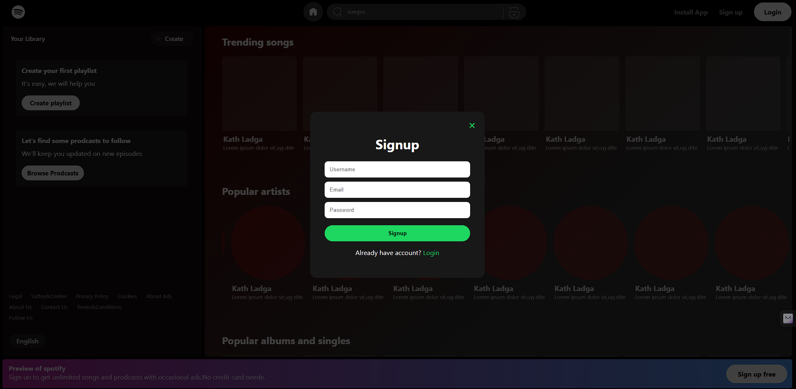
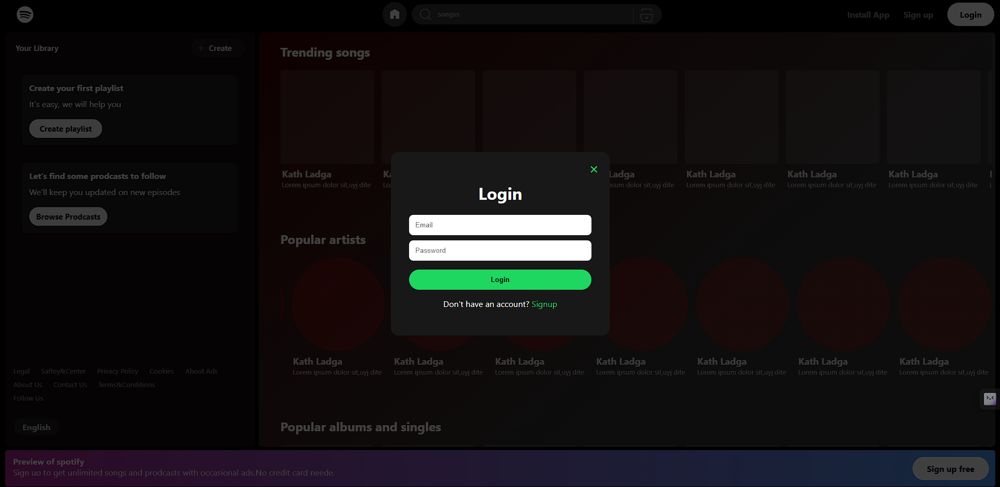
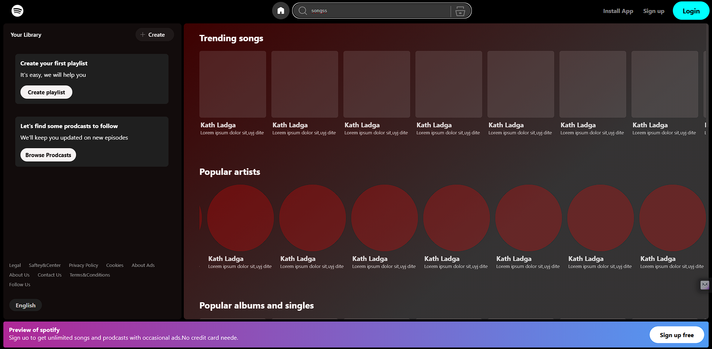

# 🎵 Spotify Landing Page Clone

A responsive Spotify-inspired landing page built using **HTML, CSS, and JavaScript**.  
This project recreates the Spotify web interface with a modern UI, interactive components, and smooth animations.

## Features

- Spotify-style landing page design
- Functional search bar
- Login and Signup popup UI
- Smooth popup animations
- Music card layout
- Responsive navigation design
- Social media icon links
- Dark Spotify-inspired theme
- Hover animations and UI effects

---

## Technologies Used

- HTML5
- CSS3
- JavaScript (ES6)
- SVG Icons

---
## 📸 Screenshot





---
## Live Demo
live link : 

## Project Structure

```
spotify-landing-page/
├── images/
│   ├── spotify1.png
│   └── spotify2.png
├── index.html
├── style.css
├── script.js
└── README.md
```

---

## Functionality

### Search System
- Search songs/cards dynamically
- Filters content while typing
- No page reload required

### Authentication UI
- Login popup
- Signup popup
- Close button functionality
- Smooth opening animation

### 🔗 Social Links
- Instagram
- Facebook
- Twitter/X

Open directly using JavaScript `window.open()`.

## 🌟 Future Improvements

- Add real Spotify API integration
- Add music playback functionality
- Add user authentication
- Improve mobile responsiveness
- Add playlists and favorite songs

---

## 👨‍💻 Author

**Abhijith Ee**

GitHub:
https://github.com/Abhijith-E0

---

## License

This project is for educational purposes only.
